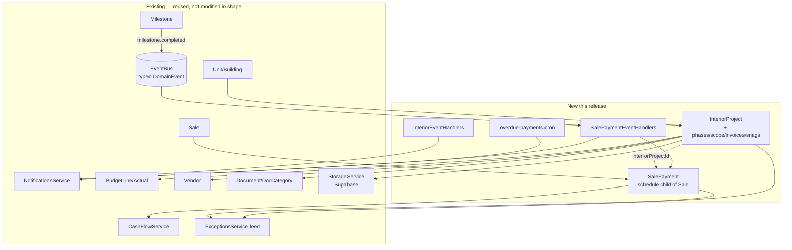

# Interior / Fit-Out + Sale Payment Schedule — Technical Design Document

**Asan Innovators** | Prepared by: Kalyan Kumar Bedugam (AK)
**Version:** 1.0 | **Date:** 2026-05-30
**Status:** Implementation-ready
**Supersedes nothing; implements:** `INTERIOR_MODULE_DESIGN.md` (converged §0) + `SALE_PAYMENT_SCHEDULE_DESIGN.md`

> **Stack note:** This TDD overrides the Asan default stack (Flutter/Supabase/Razorpay). Prime Tracker is a
> **NestJS modular-monolith + Prisma v5 + PostgreSQL** backend with a **React 18 + Vite + HeroUI + TanStack
> Query** frontend. All patterns below match the *existing* codebase conventions (verified against the `draws`,
> `sales`, and `notifications` modules).

---

## 1. Overview

Two coupled features delivered in one release train:

1. **Interior / Fit-Out module** — tracks the post-shell fit-out engagement Prime runs for some units
   (7 phases, isolated TI budget, sub-contractor invoices, snagging/punch list, handover docs).
2. **Sale Payment Schedule** — replaces the single `Sale.salePrice` with a milestone-linked installment
   schedule that feeds the cashflow forecast and powers overdue-payment alerts.

**Why together:** the client-facing interior price ("interior cost is part of the contract agreement") is a
`SalePayment` installment with `interiorProjectId` set, triggered on interior handover. Building them
separately would mean wiring the same coupling twice.

**Scale:** internal tool, ~30 users, low RPS. No special scaling work — reuse existing patterns. Correctness,
auditability, and Finance-grade money handling are the real NFRs.

---

## 2. Architecture (where this slots in)



**Key reuse decisions (already converged):**
- Standalone `InteriorProject` anchored to Unit/Building (mirrors `Sale`/`Loan` polymorphism).
- Interior money reuses `BudgetLine`/`Actual` tables with an `interiorProjectId` discriminator; **reporting**
  treats TI as a top-level category.
- Event-driven coupling via the existing typed `EventBus` (no module-to-module imports).
- New crons follow the `@Cron(CronExpression.EVERY_DAY_AT_8AM)` pattern from `draw-funding-overdue.cron.ts`.

---

## 3. Tech Stack (this feature)

| Layer | Technology | Notes |
|---|---|---|
| API | NestJS module (`interior`, plus SalePayment endpoints under `sales`) | matches `draws` module split |
| ORM | Prisma v5 | additive migration |
| DB | PostgreSQL | new tables + 2 enum extensions |
| Events | in-process `EventBus` (`common/events`) | extend `DomainEvent` union |
| Scheduling | `@nestjs/schedule` `@Cron` | new `overdue-payments.cron.ts` |
| Files | `StorageService` (Supabase) | reuse for snag photos / handover certs |
| Encryption | `EncryptionService` (AES-256-GCM) | optional, for interior contract value (open Q) |
| Frontend | React 18 + HeroUI + TanStack Query | new tab + portfolio page + hooks in `useApi.ts` |

---

## 4. Data Model

### 4.1 New enums

```prisma
enum InteriorPhase {
  DESIGN
  CLIENT_APPROVAL
  CITY_APPROVAL
  PROCUREMENT
  EXECUTION
  SNAGGING
  HANDOVER
}

enum InteriorStatus { NOT_STARTED  IN_PROGRESS  ON_HOLD  COMPLETED  CANCELLED }

enum InteriorContractType { PER_SQFT  FIXED  COST_PLUS }   // PER_SQFT is client default

enum SnagStatus { OPEN  IN_PROGRESS  RESOLVED }

enum SalePaymentStatus { SCHEDULED  DUE  PARTIALLY_PAID  PAID  OVERDUE  WAIVED }

enum SalePaymentTrigger { ON_SIGNING  ON_MILESTONE  FIXED_DATE  ON_HANDOVER }
```

### 4.2 Enum extensions (additive — safe)

```prisma
// DocCategory: add
  CITY_APPROVAL
  HANDOVER_CERTIFICATE

// NotificationType: add
  INTERIOR_PHASE_CHANGED
  INTERIOR_HANDOVER_DUE
  SNAG_OVERDUE
  PAYMENT_DUE_7
  PAYMENT_OVERDUE
```

### 4.3 New models

```prisma
model InteriorProject {
  id                String        @id @default(cuid())
  // Anchor — exactly one of (unitId, buildingId); service-enforced (mirrors Sale/Loan)
  unitId            String?
  unit              Unit?         @relation(fields: [unitId], references: [id])
  buildingId        String?
  building          Building?     @relation(fields: [buildingId], references: [id])
  // Optional context links — "interior is part of the contract"
  saleId            String?
  sale              Sale?         @relation(fields: [saleId], references: [id])
  leaseId           String?
  lease             Lease?        @relation(fields: [leaseId], references: [id])
  name              String
  status            InteriorStatus       @default(NOT_STARTED)
  phase             InteriorPhase        @default(DESIGN)
  pmId              String?
  pm                User?         @relation("InteriorPM", fields: [pmId], references: [id])
  contractType      InteriorContractType @default(PER_SQFT)
  ratePerSqft       Decimal?      @db.Decimal(12, 2)
  area              Decimal?      @db.Decimal(10, 2)
  contractValue     Decimal?      @db.Decimal(14, 2)   // internal cost-to-build; client price lives on Sale
  encryptedFields   String?       // optional AES blob (see open Q)
  packageTemplateId String?
  startDate         DateTime?
  targetEnd         DateTime?
  handoverAt        DateTime?
  // approval audit
  clientApprovedAt  DateTime?
  cityApprovedAt    DateTime?
  createdAt         DateTime      @default(now())
  updatedAt         DateTime      @updatedAt
  deletedAt         DateTime?     // soft-delete (matches Sale/Unit/Loan convention)

  scopeItems  InteriorScopeItem[]
  snags       SnagItem[]
  invoices    InteriorInvoice[]
  documents   Document[]            // via new Document.interiorProjectId

  @@index([unitId])
  @@index([buildingId])
  @@index([saleId])
  @@index([status, phase])
  @@index([deletedAt])
  @@map("interior_projects")
}

model InteriorScopeItem {
  id                String   @id @default(cuid())
  interiorProjectId String
  interiorProject   InteriorProject @relation(fields: [interiorProjectId], references: [id], onDelete: Cascade)
  description       String
  category          String?  // flooring | ceiling | MEP_ROUGH | MEP_FINISH | joinery
  quantity          Decimal? @db.Decimal(12, 2)
  unit              String?  // sqft | nos | lm
  unitPrice         Decimal? @db.Decimal(12, 2)
  total             Decimal? @db.Decimal(14, 2)
  createdAt         DateTime @default(now())

  @@index([interiorProjectId])
  @@map("interior_scope_items")
}

model InteriorInvoice {
  id                String   @id @default(cuid())
  interiorProjectId String
  interiorProject   InteriorProject @relation(fields: [interiorProjectId], references: [id], onDelete: Cascade)
  vendorId          String
  vendor            Vendor   @relation(fields: [vendorId], references: [id])
  amount            Decimal  @db.Decimal(14, 2)
  invoiceNo         String?
  invoiceDate       DateTime?
  paidAt            DateTime?
  status            String   @default("PENDING")  // PENDING | APPROVED | PAID
  // Mirror into Actual (tagged interiorProjectId) so cashflow sees the outflow
  actualId          String?
  createdAt         DateTime @default(now())
  updatedAt         DateTime @updatedAt

  @@index([interiorProjectId])
  @@index([vendorId])
  @@map("interior_invoices")
}

model SnagItem {
  id                String     @id @default(cuid())
  interiorProjectId String?
  interiorProject   InteriorProject? @relation(fields: [interiorProjectId], references: [id], onDelete: Cascade)
  milestoneId       String?    // reusable on construction snags later
  milestone         Milestone? @relation(fields: [milestoneId], references: [id], onDelete: SetNull)
  description       String
  room              String?
  assigneeId        String?
  assignee          User?      @relation("SnagAssignee", fields: [assigneeId], references: [id])
  status            SnagStatus @default(OPEN)
  photoPath         String?    // Supabase storage key
  dueDate           DateTime?
  resolvedAt        DateTime?
  createdAt         DateTime   @default(now())
  updatedAt         DateTime   @updatedAt

  @@index([interiorProjectId, status])
  @@index([milestoneId])
  @@map("snag_items")
}

model SalePayment {
  id                String   @id @default(cuid())
  saleId            String
  sale              Sale     @relation(fields: [saleId], references: [id], onDelete: Cascade)
  label             String   // "Deposit", "Foundation draw", "TI / interior", "Handover"
  sequence          Int      @default(0)
  trigger           SalePaymentTrigger @default(FIXED_DATE)
  // Either fixed date OR milestone trigger (service enforces ≥1).
  dueDate           DateTime?
  milestoneId       String?
  milestone         Milestone? @relation(fields: [milestoneId], references: [id], onDelete: SetNull)
  effectiveDueDate  DateTime?  // stamped from milestone.completedAt when ON_MILESTONE fires
  amount            Decimal  @db.Decimal(14, 2)
  percentOfPrice    Decimal? @db.Decimal(5, 2)
  paidAmount        Decimal  @default(0) @db.Decimal(14, 2)
  paidAt            DateTime?
  status            SalePaymentStatus @default(SCHEDULED)
  interiorProjectId String?  // set when this installment is the TI charge
  notes             String?
  createdAt         DateTime @default(now())
  updatedAt         DateTime @updatedAt

  @@index([saleId, sequence])
  @@index([milestoneId])
  @@index([status, effectiveDueDate])
  @@map("sale_payments")
}
```

### 4.4 Back-relations to add on existing models

| Model | Add |
|---|---|
| `Unit` | `interiorProjects InteriorProject[]` |
| `Building` | `interiorProjects InteriorProject[]` |
| `Sale` | `interiorProjects InteriorProject[]`, `payments SalePayment[]` |
| `Lease` | `interiorProjects InteriorProject[]` |
| `Milestone` | `salePayments SalePayment[]`, `snags SnagItem[]` |
| `Vendor` | `interiorInvoices InteriorInvoice[]` |
| `Document` | `interiorProjectId String?` + relation + `@@index` |
| `User` | `interiorProjects InteriorProject[] @relation("InteriorPM")`, `snagItems SnagItem[] @relation("SnagAssignee")` |

All additions are **nullable / new tables → non-breaking.**

---

## 5. Migration Plan

Single additive migration: `20260531000000_interior_and_sale_payments`.

1. `npx prisma migrate status` — confirm no drift (schema currently validates clean ✅).
2. Add enums + models + back-relations to `schema.prisma`.
3. `npx prisma migrate dev --name interior_and_sale_payments` (dev) → review SQL → commit.
4. **Data backfill (optional, separate script):** for existing `Sale` rows with a `depositAmt`, create one
   `SalePayment{ label:"Deposit", trigger:ON_SIGNING, amount:depositAmt, status: paid? }`. Gated behind a
   one-shot seed command; **not** in the schema migration.
5. Seed: add 1–2 interior **package templates** + a demo interior project for the seed dataset.
6. Production: `prisma migrate deploy`. No destructive ops, no downtime.

---

## 6. Backend Design (NestJS)

### 6.1 Module layout (mirrors `draws`)

```
apps/api/src/modules/interior/
  interior.module.ts
  interior.controller.ts          // /api/interior  (CRUD + phase transitions + scope/invoice/snag subroutes)
  interior.service.ts             // business logic + soft parallel gate + doc gates
  interior-state-machine.ts       // legal phase transitions (mirror draw-state-machine.ts)
  interior-event-handlers.service.ts  // OnModuleInit → bus subscriptions
  overdue-snag.cron.ts            // daily snag-overdue + handover-due
  dto/
    create-interior.dto.ts
    update-interior.dto.ts
    advance-phase.dto.ts
    scope-item.dto.ts
    interior-invoice.dto.ts
    snag.dto.ts
```

SalePayment lives **under the existing `sales` module** (it's a child of Sale, entangled with sale reads —
same reasoning the codebase uses for keeping DrawRequest CRUD under `loans`):

```
apps/api/src/modules/sales/
  sale-payments.service.ts
  sale-payment-event-handlers.service.ts   // subscribes milestone.completed
  overdue-payments.cron.ts
  dto/{create-sale-payment.dto.ts, update-sale-payment.dto.ts, log-payment.dto.ts}
  // new routes added to sales.controller.ts
```

### 6.2 Controllers & routes

**Interior** (`@Controller('interior')`, guards: `JwtAuthGuard, PermissionsGuard`, `AuditInterceptor`):

| Method | Path | Permission | Purpose |
|---|---|---|---|
| GET | `/interior?unitId=&buildingId=&status=` | `interior:view` | list (filterable) |
| GET | `/interior/portfolio` | `interior:view` | cross-project portfolio (phase, budget vs actual, days-to-handover) |
| GET | `/interior/:id` | `interior:view` | detail incl. scope/snags/invoices/docs |
| POST | `/interior` | `interior:edit` | create (per-sqft contract calc) |
| PATCH | `/interior/:id` | `interior:edit` | update |
| POST | `/interior/:id/advance` | `interior:edit` | advance phase (state machine + gates) |
| POST | `/interior/:id/approve-client` | `interior:approve` | record client approval |
| POST | `/interior/:id/approve-city` | `interior:approve` | record city approval |
| DELETE | `/interior/:id` | `interior:edit` | soft-delete |
| POST/PATCH/DELETE | `/interior/:id/scope` | `interior:edit` | BOQ items |
| POST/PATCH | `/interior/:id/invoices` | `interior:finance` | sub-contractor invoices |
| POST/PATCH | `/interior/:id/snags` | `interior:edit` | punch list |

**SalePayment** (added to `@Controller('sales')`):

| Method | Path | Permission | Purpose |
|---|---|---|---|
| GET | `/sales/:saleId/payments` | `sales:view` | schedule for a sale |
| POST | `/sales/:saleId/payments` | `sales:edit` | add installment |
| POST | `/sales/:saleId/payments/from-template` | `sales:edit` | seed from template (10/40/50…) |
| PATCH | `/sales/payments/:id` | `sales:edit` | edit installment |
| POST | `/sales/payments/:id/log` | `payment:log` | log a (partial) payment |
| DELETE | `/sales/payments/:id` | `sales:edit` | remove installment |
| GET | `/sales/receivables?weeks=4` | `finance:view` | upcoming receivables (cashflow widget) |

### 6.3 Key service logic

**`InteriorService.advancePhase(id, target, userId)`**
1. Load project; run `interiorStateMachine.canTransition(current, target)` (linear 7-phase order).
2. **Soft parallel gate (§0.2):** if target ∈ {`PROCUREMENT`,`EXECUTION`} → assert the anchor unit/building
   shell phase is complete (`buildingPhaseComplete()`), else `ConflictException`.
3. **Document gates (§0.3):** entering `EXECUTION` requires a `Document{category: CITY_APPROVAL}` on the
   project; entering `HANDOVER` requires `Document{category: HANDOVER_CERTIFICATE}` on the interior project,
   else `ConflictException` with the missing-doc message.
4. Persist; set `handoverAt` when entering HANDOVER; emit `interior.phaseChanged` (+ `interior.handedOver`).

**`InteriorService.createInvoice()`** — creates `InteriorInvoice` AND a paired `Actual` tagged with
`interiorProjectId` (so cashflow + TI reporting work) inside one `$transaction`.

**`SalePaymentsService.logPayment(id, amount)`** — increments `paidAmount`; flips status to `PAID`
(`paidAmount >= amount`) or `PARTIALLY_PAID`; sets `paidAt`; emits `salePayment.paid`.

**`SalePaymentsService.applyMilestoneCompletion(milestoneId, completedAt)`** — called by the event handler:
stamps `effectiveDueDate = completedAt` and flips `SCHEDULED → DUE` for all linked `ON_MILESTONE` payments.

### 6.4 Event bus integration (extend `domain-events.ts`)

```ts
// Interior
| { type: 'interior.phaseChanged'; interiorProjectId: string; from: string; to: string }
| { type: 'interior.handedOver'; interiorProjectId: string; unitId?: string; at: Date }
| { type: 'snag.overdue'; snagId: string; interiorProjectId: string; daysOverdue: number }
// Sale payments
| { type: 'salePayment.due'; salePaymentId: string; saleId: string }
| { type: 'salePayment.paid'; salePaymentId: string; saleId: string; amount: number }
| { type: 'salePayment.overdue'; salePaymentId: string; saleId: string; daysOverdue: number }
```

Subscriptions (in `*EventHandlers` `onModuleInit`, mirroring `DrawEventHandlers`):
- `SalePaymentEventHandlers` subscribes existing **`milestone.completed`** → `applyMilestoneCompletion()`.
- `InteriorEventHandlers` subscribes `interior.handedOver` → if a linked `SalePayment(trigger: ON_HANDOVER)`
  exists, flip it to `DUE`.
- Both emit notifications via `NotificationsService` named triggers (new: `notifyPaymentOverdue`,
  `notifyInteriorPhaseChanged`, `notifySnagOverdue`).

### 6.5 Crons (daily 8AM CT — reuse existing pattern)

- `overdue-payments.cron.ts`: find `SalePayment` where `effectiveDueDate||dueDate < now`, status ∈
  {SCHEDULED,DUE,PARTIALLY_PAID} → flip `OVERDUE`, emit `salePayment.overdue`. Also `PAYMENT_DUE_7`
  look-ahead. (New `checkOverduePayments()` — can also be added to the existing
  `scheduled-notifications.service.ts` instead of a new file; either matches convention.)
- `overdue-snag.cron.ts`: snags past `dueDate` and OPEN → emit `snag.overdue`; interior projects with
  `targetEnd` near and not handed over → `INTERIOR_HANDOVER_DUE`.

### 6.6 Cashflow + Exceptions wiring (the payoff)

- `CashFlowService.getForecast()` adds **inflows** from `SalePayment` (by `effectiveDueDate||dueDate`,
  `amount - paidAmount`, exclude PAID/WAIVED) and **outflows** already captured via interior `Actual`s.
- `ExceptionsService.compute()` adds two computed items: overdue sale payments and overdue snags / stalled
  interior phases → they surface in the existing `ExceptionFeed` (Overview tab + dashboards) with **no new page**.

---

## 7. Frontend Design (React + HeroUI + TanStack Query)

### 7.1 Pages / tabs
- **Interior tab on `UnitDetailPage`** — phase stepper (HeroUI), BOQ table, snag list, invoices, docs, "Advance
  phase" action (disabled + tooltip when a gate blocks it).
- **`InteriorPortfolioPage`** (`/interior`, perm `interior:view`) — table: project, phase, budget vs actual,
  days-to-handover. New sidebar nav item (`Layout.tsx`, e.g. `FiGrid`).
- **SalePayment panel** inside the Sale detail (Revenue tab → Sales) — installment rows, status chips
  (reuse `CommentChip`/`StatusBadge` style), "% paid" `Progress` bar, "Log payment" modal, "Apply template".
- **Finance dashboard widget** — "Receivables next 4 weeks" from `/sales/receivables`.

### 7.2 Hooks (add to `apps/web/src/hooks/useApi.ts`)
```
useInteriorProjects(params)  useInteriorProject(id)  useInteriorPortfolio()
useCreateInterior() useUpdateInterior() useAdvanceInteriorPhase() useDeleteInterior()
useInteriorScope()/useSaveScopeItem()  useInteriorInvoices()/useCreateInteriorInvoice()
useSnags()/useSaveSnag()
useSalePayments(saleId)  useCreateSalePayment()  useApplyPaymentTemplate()
useLogPayment()  useUpdateSalePayment()  useDeleteSalePayment()  useReceivables(weeks)
```
Query-key convention: `['interior', ...]`, `['salePayments', saleId]` — invalidate on mutations as elsewhere.

### 7.3 Permissions / RBAC
| Permission | Roles |
|---|---|
| `interior:view` | PM, CONSTRUCTION, FOUNDER, EXECUTIVE, FINANCE |
| `interior:edit` | PROJECT_MANAGER, FOUNDER |
| `interior:approve` | FOUNDER, EXECUTIVE (+ a CITY approver of record — open Q) |
| `interior:finance` | FINANCE, ACCOUNTING, AR_AP |
| `payment:log` | FINANCE, ACCOUNTING, AR_AP (and SALES? — open Q) |
Wire into the auth permission map; gate routes via `<ProtectedRoute permission>` and ProjectDetail `TAB_ROLES`.

---

## 8. Test Plan

**Unit (Jest, `*.spec.ts` next to source — existing convention):**
- `interior-state-machine.spec.ts` — every legal/illegal transition; linear order enforced.
- `interior.service.spec.ts` — soft parallel gate (block PROCUREMENT/EXECUTION pre-shell; allow DESIGN/approvals);
  doc gate (block EXECUTION w/o CITY_APPROVAL doc, HANDOVER w/o certificate); per-sqft contract calc;
  invoice→Actual transaction.
- `sale-payments.service.spec.ts` — partial payment → PARTIALLY_PAID; full → PAID; % vs fixed amount;
  `applyMilestoneCompletion` stamps `effectiveDueDate` + flips DUE; template seeding.
- `overdue-payments.cron.spec.ts` / `overdue-snag.cron.spec.ts` — overdue detection + event emission (fake timers).

**Integration (e2e, supertest):**
- Interior lifecycle: create → advance through 7 phases hitting both gates → handover sets `handoverAt`.
- Milestone completion event → linked SalePayment becomes DUE (cross-module via bus).
- Interior handover event → ON_HANDOVER TI payment becomes DUE.
- Cashflow forecast includes scheduled inflows; excludes PAID/WAIVED.
- RBAC: `interior:view` user cannot POST; `payment:log` enforced.

**Manual / QA:** UI phase stepper gate tooltips; receivables widget numbers; ExceptionFeed surfaces overdue items.

**Coverage target:** ≥ 80% on the two new services + state machine (money + gates are the risk surface).

---

## 9. Non-Functional Requirements
- **Money correctness:** all Decimal(14,2); invoice↔Actual and payment writes in `$transaction`; no float.
- **Auditability:** all mutations through `AuditInterceptor` (already global on controllers).
- **Soft-delete** on `InteriorProject` (financial history retention, matches Sale/Loan).
- **Idempotent events:** handlers tolerate duplicate `milestone.completed` (check status before flipping).
- **Security:** new permissions enforced server-side; optional AES on `contractValue` via `EncryptionService`.

---

## 10. Constraints & Locked Decisions
- Standalone `InteriorProject`, unit/building-anchored, one-unit-→-many (renovations).
- No new role — same PM (reuse PROJECT_MANAGER).
- Reuse `BudgetLine`/`Actual` + `interiorProjectId` tag; TI is a **top-level reporting category**, not a subset.
- Client price = `SalePayment` on the Sale; interior `contractValue` = internal cost-to-build.
- Soft parallel gate (block only Procurement/Execution); doc gates in scope (CITY_APPROVAL, HANDOVER_CERTIFICATE).
- SalePayment supports **both** fixed date and milestone trigger; partial payments; % or fixed amount.
- All event coupling via `EventBus` — no module-to-module imports.

---

## 11. Open Questions & Risks
1. **Deposit migration** — fold `Sale.depositAmt` into a SalePayment ON_SIGNING row (recommended) or keep separate?
2. **Schedule templates** — what are Prime's 1–2 standard installment structures? (needed for the template feature / adoption).
3. **`payment:log` scope** — Finance/Accounting only, or Sales too?
4. **City Approval approver of record** — which user/role signs it in-system?
5. **Interior contract packages** — provide the 2–3 generic package definitions, or model structure + fill later?
6. **Encryption** — encrypt interior `contractValue` like loans, or plain?
7. **Adoption risk** — if Sales don't maintain schedules, cashflow stays fictional → templates are the mitigation; track usage post-launch.

---
*Asan Innovators — Building Beyond Boundaries*
*Confidential — Asan Innovators © 2026*
